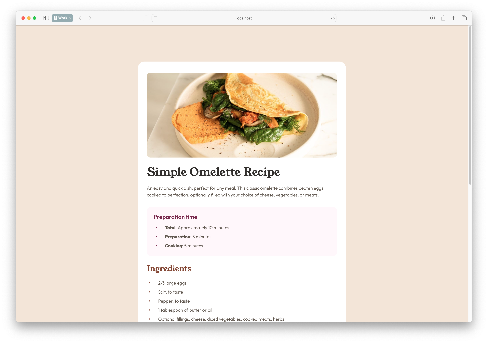

# Frontend Mentor - Recipe Page Solution

This is a solution to the [Recipe page challenge on Frontend Mentor](https://www.frontendmentor.io/challenges/recipe-page-KiTsR8QQKm). Frontend Mentor challenges help you improve your coding skills by building realistic projects.

## Table of contents

- [Overview](#overview)
  - [Screenshot](#screenshot)
  - [Links](#links)
- [My process](#my-process)
  - [Built with](#built-with)
  - [What I learned](#what-i-learned)
  - [Continued development](#continued-development)
  - [Useful resources](#useful-resources)
- [Author](#author)

## Overview

### Screenshot



### Links

- Solution URL: [Add solution URL here](https://github.com/aeosmanoglu/recipe-page)
- Live Site URL: [Add live site URL here](https://aeosmanoglu.github.io/recipe-page/)

## My process

### Built with

- Semantic HTML5 markup
- Tailwind CSS
- Flexbox
- Mobile-first workflow

### What I learned

While working on this project, I improved my understanding of Tailwind CSS, particularly in responsive design. Here’s an example of responsive image handling using Tailwind:

```html

```

This allows me to hide certain images on larger screens while showing different ones for better performance and layout.

### Continued development

I plan to continue improving my skills in responsive design and CSS utility frameworks like Tailwind. Future projects will involve more interactive elements and dynamic layouts.

### Useful resources

- [Tailwind CSS Documentation](https://tailwindcss.com/docs) - This is the official documentation for Tailwind, and it helped me understand how to structure my layout and style efficiently.

## Author

- Website - [Abuzer Emre Osmanoğlu](https://abuzeremre.com)
- Frontend Mentor - [@aeosmanoglu](https://www.frontendmentor.io/profile/aeosmanoglu)
- Twitter - [@abuzeremreo](https://twitter.com/abuzeremreo)
